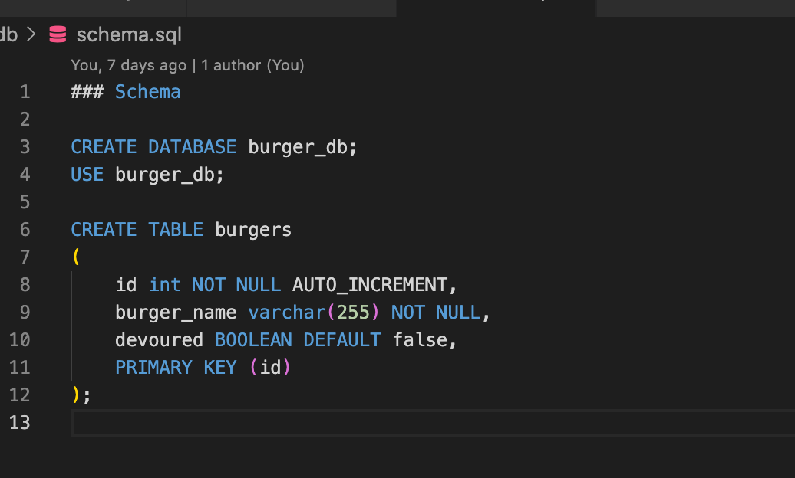

# Eat_Da_Burger
## Description
Eat-Da-Burger is a restaurant app that lets users order the burger they'd like to eat. Whenever a user submits a burger's name, the app will display the burger in the middle of the page waiting to be picked up. Each burger in the waiting area have a pickup button. When the user clicks it, the burger will move to the right side of the page. There they can click a button that throws the finished burger into the trash. This app stores every burger in the database until it is thrown away.
## Table of Contents

* [Title](#Title)

* [Description](##Description)

* [Link-to-project](##Link-to-project)

* [Installation](##Installation)

* [User-Story](##User-Story)

* [License](##License)

* [Contribution](##Contribution)  

* [Test](##Test)

* [Images](##Images)

* [Credits](##Credits)

* [Questions](##Questions)

## Link-to-project 
[Github Repo Eat_Da_Burger](https://github.com/LauraGwendolynBurch/Eat_Da_Burger)

[Heroku Project link Eat_Da_Burger](https://rocky-fortress-95014.herokuapp.com/)

## Installation
* NPM i inquirer
* NPM i mysql
* NPM express
* NPM express-handlebars

## User-Story
This was a great challenge for a first time coder.  I very much enjoy working on and seeing the full stack application.  

## License
[GNU GENERAL PUBLIC LICENSE 2.0](https://opensource.org/licenses/GPL-2.0)

## Contribution
Clone repo | Push changes | Create Pull request

## Image of sample code

## Image of Application 

## Credits
Anna Conover (tutor)

University of Washington Bootcamp TAs and Instructor

Study Group: Aaron Parnell, Keenan Reed, Sally Perez, Rattanak Leng

## Questions
GitHub Username: [LauraGwendolynBurch](https://github.com/LauraGwendolynBurch)

Email: <lauraburch.lb@gmail.com>

